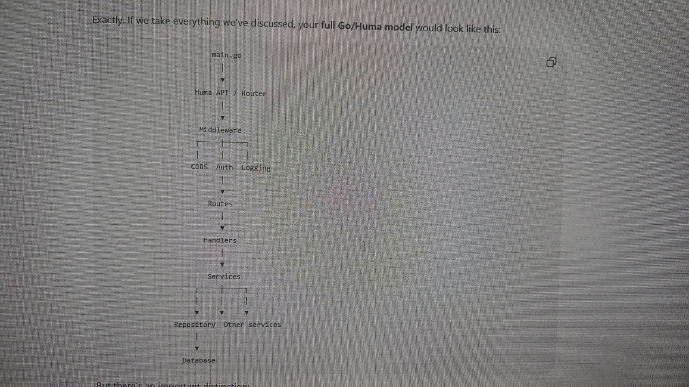
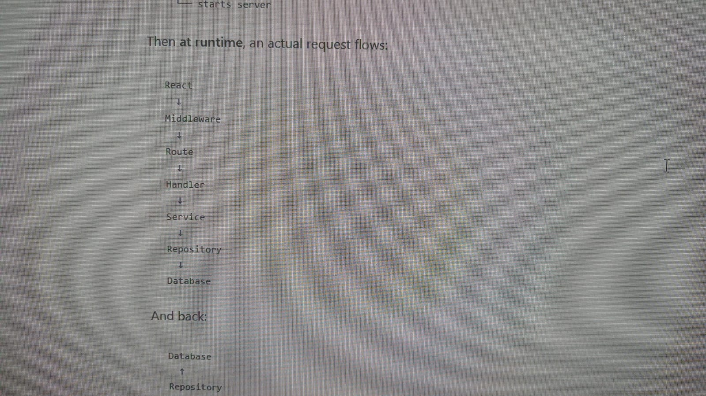

my-go-project/
├── main.go            # Entry point (initializes DB, router, starts server)
├── handlers/          # Equivalent to FastAPI routers (HTTP layer)
├── services/          # Equivalent to FastAPI services (Business logic)
├── repositories/      # Equivalent to database/backend calls (Data access)
└── models/            # Equivalent to Pydantic/SQLAlchemy models (Structs)

  

go mod init is like setting up your project environment or running pip init / initializing poetry.

go.mod plays the exact same role as requirements.txt or a lock file, listing all the external packages your project depends on and their versions.

go get is essentially pip install.